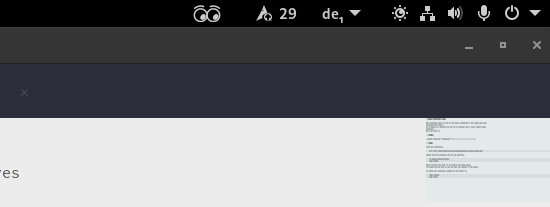

<h1 align="center">
    GNOME Extension: Glasa
</h1>

    This extension puts an icon in the panel consisting of two comic-like eyes following the cursor.
    It is meant as a present and not to be confused with a fully robust GNOME extension.
    Have fun with it.

    
    
    
    
    

    

## Getting Started

It is highly recommended to get this extension by using the [GNOME Extensions' Website](https://extensions.gnome.org/) and searching for `glasa`.
Otherwise you can also use [this link](https://extensions.gnome.org/extension/4780/glasa/).

## Manual Installation and Development Usage

Clone the repository.

    git clone https://github.com/lyrahgames/gnome-extension-glasa.git

Change into the directory and run the makefile.

    cd gnome-extension-glasa
    make

Press `Alt+F2` and type `r` to restart the Gnome shell if you are running on X11.
In the case you are running on Wayland log out and in again.
Afterwards enable the extension.

    make enable

You should now be able to see the eyes icon appear in the panel.
Otherwise, restart the Gnome shell again by pressing `Alt+F2` and typing `r`.

You can disable the extension as follows.

    make disable

For uninstalling, run the following command.

    make uninstall

Show the preferences window for the extension.

    make prefs

The following command will create a compressed ZIP file for the distribution on GNOME extensions' website.

    make pack

## Notes

- This repository is based on the soure code from [eye by azathoth](https://extensions.gnome.org/extension/213/eye/).
- A non-comic and more advanced alternative is given by [Eye and Mouse Extended on GitHub](https://github.com/alexeylovchikov/eye-extended-shell-extension) and [Eye and Mouse Extended on GNOME Extension Hub](https://extensions.gnome.org/extension/3139/eye-extended/).

## Contact and Contributing

If you have any questions or comments regarding `glasa`, please don't hesitate to reach out at lyrahgames@mailbox.org.
If you come across any bugs, encounter issues, or miss some neat features, please make use of the GitHub issue tracking page or send a pull request.

## Copyright and License

The copyright for the code is held by the contributors of the code.
The revision history in the version control system is the primary source of authorship information for copyright purposes.
Please see individual source files for appropriate copyright notices.

`glasa` is free software, distributed under the terms of the GNU General
Public License as published by the Free Software Foundation,
version 3 of the License (or any later version).  For more information,
see the [GNU General Public License][GPLv3] or the file [`COPYING.md`](COPYING.md).

`glasa` is distributed in the hope that it will be useful, but WITHOUT ANY WARRANTY; without even the implied warranty of MERCHANTABILITY or FITNESS FOR A PARTICULAR PURPOSE. See the GNU General Public License for more details.

Copying and distribution of this file, with or without modification, are permitted in any medium without royalty provided the copyright notice and this notice are preserved.
This file is offered as-is, without any warranty.

## References and Other Resources

- [GJS Guide](https://gjs.guide/)
- [Port Extensions to GNOME Shell 40](https://gjs.guide/extensions/upgrading/gnome-shell-40.html)
- [Port Extensions to GNOME Shell 42](https://gjs.guide/extensions/upgrading/gnome-shell-42.html#metadata-json)
- [Port Extension to GNOME Shell 45](https://gjs.guide/extensions/upgrading/gnome-shell-45.html#esm)
